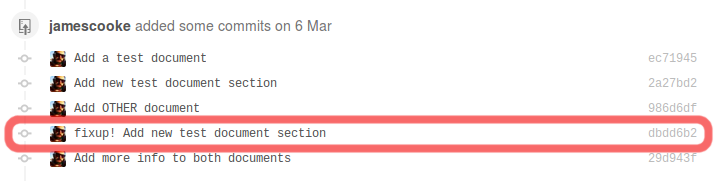

PRLint: A linter for Pull Requests
==================================

.. image:: https://circleci.com/gh/jamescooke/prlint.svg?style=shield
    :target: https://circleci.com/gh/jamescooke/prlint

PRLint helps improve the quality of git commits entering a repository's
history by flagging commits that do not meet required standards.

For each Pull Request received, it lints the Pull Request's commits against a
set of rules. Pull Requests that contain commits that do not meet the required
standards will be set to RED and fail.

Tests the whole branch, not just git ``HEAD``
---------------------------------------------

The majority of testing services test only the final ``HEAD`` commit of a Pull
Request. This is good enough when a team only cares about the final patch about
to be applied, or in situations where the commits in every successful Pull
Request are squashed into a single commit. However, some teams maintain git
history and there are some conditions where the team may care about every
commit in a Pull Request.

PRLint checks every commit in the Pull Request, to ensure that every one meets
the requirements of the repository.

Fixup commits
-------------

Take, for example, ``fixup!`` commits created with ``git commit --fixup=``. In
`Pull Request #1 <https://github.com/jamescooke/prlint/pull/1>`_ there is a
``!fixup`` commit waiting to be squashed - it is highlighted here in red:

Although the diff of the Pull Request is valid, we want to block the merge of
the Pull Request until the fixup commit is autosquashed. Otherwise the fixup
commit will enter our master branch and pollute the history.

PRLint tests every commit in a Pull Request and fails if any commit doesn't
pass the rules set for the repository.

    TODO: Add failing status image and resolution.

Summary of default rules
------------------------

TODO: will happen :smile:

Further info
------------

PRLint was originally called "nofixup" because it was built to catch fixup
commits and set the ``HEAD`` commit of the Pull Request to failing if any were
found.

You can read more about `fixup commits and autosquashing in this thoughtbot
article <https://robots.thoughtbot.com/autosquashing-git-commits>`_.

Values
------

* Open and accessible always: The `project is open-source </LICENSE>`_, you can
  take it and run your own instance.

* Generic and flexible: Although PRLint is written in Python, it can be used
  with any repository written in any languages. It aims to support as many
  workflows as possible.

* Multiple integrations: Primarily PRLint integrates with GitHub and works with
  the GitHub style of Pull Request. PRLint will integrate with as many services
  as possible.

Install
=======

You will need ``python3``, ``virtualenv`` and ``pip`` installed to be able to
use this project in its current state. You'll also need GNU ``make`` or similar
to be able to follow these install and testing instructions.

Clone this repository::

    git clone git@github.com:jamescooke/prlint.git

Create a virtualenv containing Python3::

    make venv

Activate and install requirements::

    . venv/bin/activate
    make install

Testing
=======

With the virtual environment active, add the testing requirements::

    make install-test

Run tests with Django's test runner which is configured to use Nose::

    make test

Check linting with ``flake8``::

    make lint
